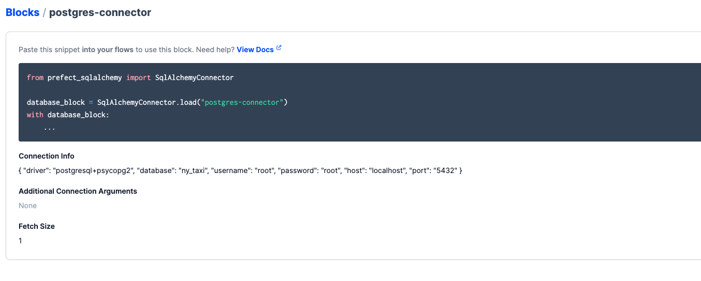
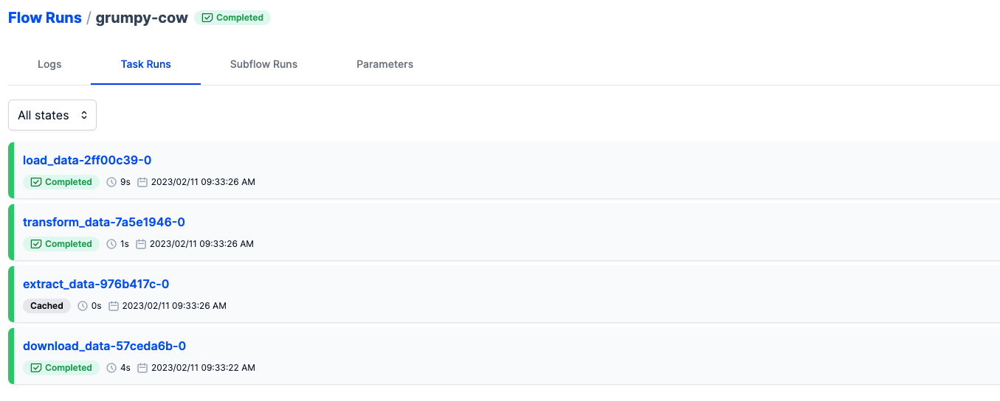

## Prefect Local

In this guide we will use prefect to load data into a postgres dabase.

Getting prefect running locally, do the following:

1. Start up the docker containers
```
docker-compose up -d
```

2. Create the database by going to localhost:8080 and configuring a database called `ny_taxi`.

3. Now you can start the prefect UI by running:

```
prefect orion start
```


In prefect, we will utilise the SQLAlchemy connection block to configure our connection to the postgres database. This is to avoid having to store the credentials and configure the connection engine locally. 
The block is installed through the `prefect-sqlalchemy` python package. 

Through the UI, configure the block by adding the connection info such as host, port, database, username and password. Once complete it will look like this:


4. You can see the block being used in the `load_data` function in the `ingest_data` script. To run the script, simply execute:

```
python ingest_data.py
```

5. View the flow run in the UI:

